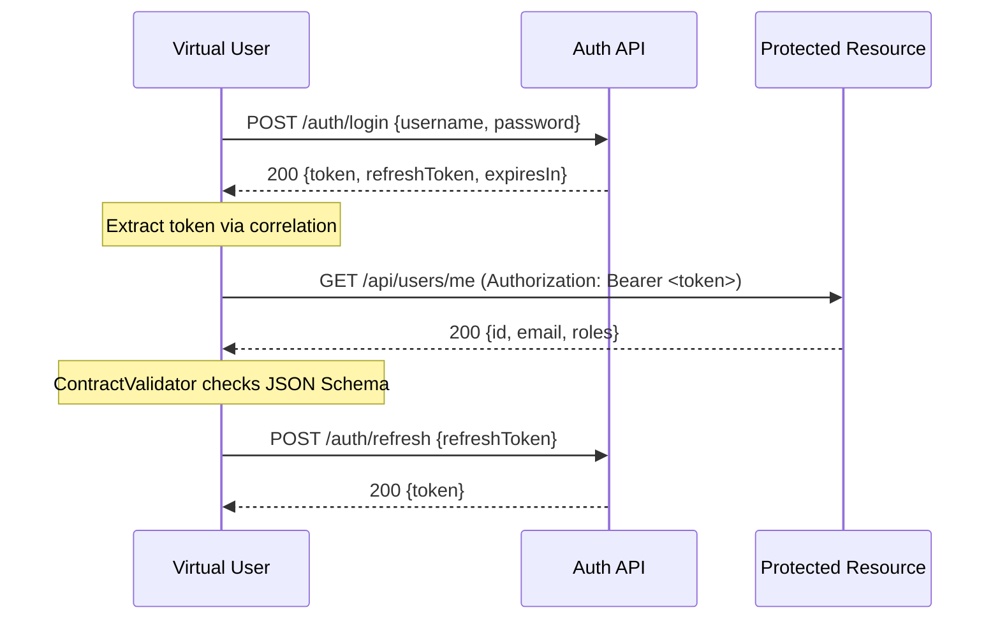
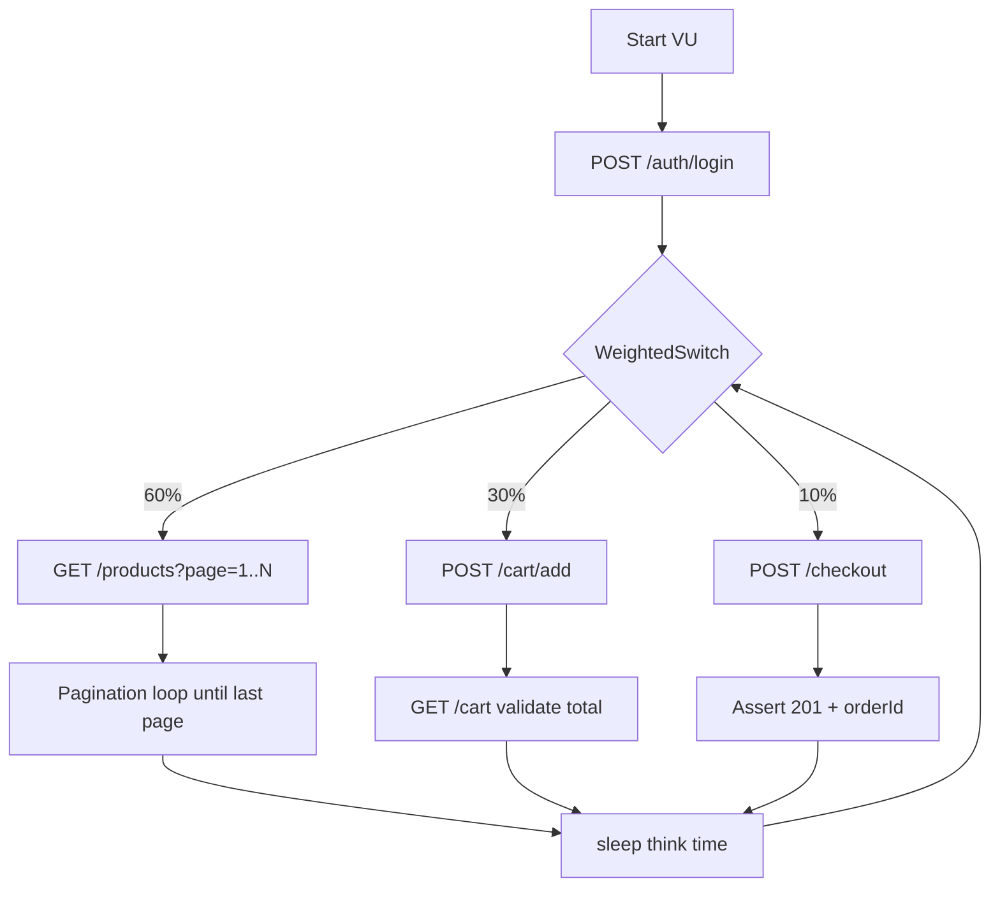

> [Español](README.es.md) | **English**

# _reference — Reference Client

Canonical reference implementation of the k6 Enterprise Framework client layer.
Use as a starting point for new clients and to understand framework capabilities.

## Canonical Buckets

All `clients/<name>/scenarios/` directories follow the same 5-bucket taxonomy (TST-01 / Phase 2):

| Bucket | Purpose | Example | Run |
|--------|---------|---------|-----|
| `api/` | Single-endpoint smoke probes | `api/smoke-users.ts` | `--client=_reference --scenario=api/smoke-users` |
| `flow/` | Multi-step integration flows | `flow/auth-flow.ts` | `--client=_reference --scenario=flow/auth-flow` |
| `domain/` | Service-level scenarios, sub-grouped by service (`domain/<service>/<action>.ts`) | `domain/orders-lifecycle.ts` | `--client=_reference --scenario=domain/orders-lifecycle` |
| `chaos/` | FCI / fault-injection / resilience | `chaos/fci-spike.ts` | `--client=_reference --scenario=chaos/fci-spike` |
| `perf/` | Capacity, breakpoint, stress, soak | `perf/breakpoint-tier.ts` | `--client=_reference --scenario=perf/breakpoint-tier` |

**Not buckets:** `unit/` lives under `test/` (Vitest, Node.js), not `clients/*/scenarios/`. No 6th bucket without amending the taxonomy.

This `_reference/` client is the canonical layout — mirror its structure when starting a new client.

## Scenario Index

| # | Scenario | Complexity | Protocols | Patterns | Expected p95 |
|---|----------|-----------|-----------|----------|-------------|
| 1 | `api/smoke-users` | Basic | HTTP | Auth, Correlation, Checks | < 500ms |
| 2 | `flow/auth-flow` | Intermediate | HTTP | Retry, ContractValidation | < 1000ms |
| 3 | `flow/checkout-flow` | Advanced | HTTP | Pagination, WeightedSwitch, PerformanceHelper | < 800ms |
| 4 | `api/16-redis-data-pool` | Intermediate | HTTP+Redis | SharedArray, DataPool, Teardown | < 500ms |
| 5 | `domain/orders-lifecycle` | Basic | k6-builtins (hermetic) | Counter, Trend, Checks | n/a |
| 6 | `chaos/fci-spike` | Basic | k6-builtins (hermetic) | Rate, Counter, Window logic | n/a |
| 7 | `perf/breakpoint-tier` | Basic | k6-builtins (hermetic) | Trend tags, tier mapping | per-tier thresholds |

---

## Running Scenarios

```bash
# Identity for the reference RBAC (config/rbac.json, role developer)
export K6_USER=reference-dev

# Basic (1-3): smoke test — fastest CI check (~1 min)
./bin/run-test.sh --client=_reference --scenario=api/smoke-users --profile=smoke

# Intermediate (4-8): load test — normal traffic (~14 min)
./bin/run-test.sh --client=_reference --scenario=integration/auth-flow --profile=load

# Advanced (9-15): stress test — find breaking point (~25 min)
# Needs role lead or admin: add your user to config/rbac.json first (see RBAC)
./bin/run-test.sh --client=_reference --scenario=mixed/checkout-flow --profile=stress

# Run all reference scenarios
./bin/testing/run-all-tests.sh --client=_reference

# Parallel execution (faster CI)
./bin/testing/run-all-tests.sh --client=_reference --parallel=2

# With a specific environment
./bin/run-test.sh --client=_reference --scenario=api/smoke-users --profile=smoke --env=staging
```

## RBAC

The runner checks RBAC before every run (Step 2b) and **fails closed**: a client without
`config/rbac.json` cannot run anything unless `K6_RBAC_PERMISSIVE=true` is set.
`_reference` ships a minimal `config/rbac.json` so the quick start works out of the box:

```json
{ "users": [ { "id": "reference-dev", "role": "developer" } ] }
```

- `reference-dev` is a shared, non-personal identity. Select it with `K6_USER=reference-dev`
  (identity resolution: `K6_USER` > `$USER`).
- `developer` is the lowest role: profiles `smoke`, `quick`, `load`, `throughput-low` and
  `throughput-medium`. `stress`, `spike`, `capacity`, `breakpoint`, `soak`,
  `throughput-high` and `throughput-ramp` are denied.
- Because the file exists, `K6_RBAC_PERMISSIVE=true` no longer applies to `_reference`:
  any user not listed is denied.

To adjust it, add your own users and roles (`developer`, `lead`, `admin`), for example:

```json
{
  "users": [
    { "id": "reference-dev", "role": "developer" },
    { "id": "your-login", "role": "lead", "email": "you@example.com" }
  ]
}
```

Roles and their permissions are built in (`src/core/rbac.ts`); the file only maps users to
roles. When you copy `_reference` to start a real client, replace `reference-dev` with your
team's users. `K6_USER` is read from the environment, so without `K6_AUTH_TOKEN` RBAC is a
guardrail, not authentication.

## Common Errors

Two flags are REQUIRED on every `bin/run-test.sh` call and they are NOT interchangeable:

- `--client=<name>` — selects which `clients/<name>/` directory to use.
- `--scenario=<bucket>/<path>` — the path MUST start with one of the 5 canonical buckets (`api`, `flow`, `domain`, `chaos`, `perf`).

### 1. `invalid bucket 'xyz'`

```bash
# Wrong — 'bc' is not a canonical bucket
./bin/run-test.sh --client=my-client --scenario=bc/orders/get-order --profile=smoke
# [ERROR] invalid bucket 'bc' in --scenario='bc/orders/get-order'

# Right — prefix with a canonical bucket
./bin/run-test.sh --client=my-client --scenario=domain/orders/get-order --profile=smoke
```

### 2. Missing `--client=`

```bash
# Wrong — no --client flag
./bin/run-test.sh --scenario=domain/orders/get-order --profile=smoke
# [ERROR] --scenario='domain/orders/get-order' not found: clients//scenarios/ does not exist

# Right
./bin/run-test.sh --client=_reference --scenario=domain/orders/get-order --profile=smoke
```

### Full canonical example

```bash
./bin/run-test.sh --client=_reference --scenario=domain/orders/lifecycle --profile=smoke
```

Refer to the bucket table at the top of this README for the full taxonomy. Tooling: pnpm only — never npm / yarn / npx.

---

## Scenario Details

### 1. `api/smoke-users` — Basic

**Purpose**: Verify the service is operational. Fastest scenario for CI gates.

**Flow**:
```
GET /health → 200
POST /auth/login → extract token
GET /users?page=1 → check schema
GET /users/:id → check response time
```

**Expected output**:
```
checks................: 100%   ✓ 24 ✗ 0
http_req_duration.....: p(95)=245ms   ← should be < 500ms
http_req_failed.......: 0.00%
```

**Troubleshooting**:
- Mock server not running → `npm run mock -- --client=_reference`
- `BASE_URL` not set → check `clients/_reference/config/default.json`
- Auth fails (401) → verify `APP_API_TOKEN` env var is set

---

### 2. `integration/auth-flow` — Intermediate

**Purpose**: Validate the full auth + token flow under load with contract testing.

**Flow** (mermaid):


**Expected output**:
```
checks................: 100%   ✓ schema_valid, status_200, token_present
http_req_duration.....: p(95)=380ms   ← should be < 1000ms
http_req_failed.......: 0.00%
```

**Troubleshooting**:
- `AUTH_USERNAME` / `AUTH_PASSWORD` not set → add to `.env` or pass via `--env`
- 401 errors → invalid credentials or expired token
- Schema violations → upstream API changed; update `lib/services/user-service.ts`

---

### 3. `mixed/checkout-flow` — Advanced

**Purpose**: End-to-end checkout flow with pagination, weighted traffic, and perf analysis.

**Flow** (mermaid):


**Expected output**:
```
checks................: 95%+   ✓ status, schema, response_time
http_req_duration.....: p(95)=650ms   ← should be < 800ms
iterations............: 200+  at 20 VUs
```

**Troubleshoot**:
- High error rate → payment service mock must be running (`npm run mock`)
- Slow p95 → reduce `--profile` to `load` or add `--env K6_THINK_TIME_MS=500`
- Pagination loop infinite → check `totalPages` in response schema

---

### 4. `api/16-redis-data-pool` — Intermediate

**Purpose**: Demonstrate unique data-per-VU pattern using Redis SharedArray.

**Requires**: Redis running (`docker compose --profile redis up -d`)

**Expected output**:
```
[setup]  Loaded 100 users into Redis pool
[default] Each VU consumes unique user — no collisions
[teardown] Cleaned up Redis keys
```

**Troubleshoot**:
- `REDIS_URL` not set → defaults to `redis://localhost:6379`
- Connection refused → start Redis: `docker compose --profile redis up -d`

---

## Best Practices Checklist

- [ ] No hardcoded credentials — use `${ENV_VAR}` in config or `.env`
- [ ] Every scenario has `thresholds` defined (p95, error rate)
- [ ] Auth tokens extracted via correlation, not stored as globals
- [ ] Schema validation on key responses (`ContractValidator`)
- [ ] Think time between requests (`sleep(randomBetween(1, 3))`)
- [ ] `setup()` / `teardown()` for stateful resources (Redis, DB seeds)
- [ ] Scenario runs clean from smoke to stress without code changes
- [ ] Report artifacts saved to `reports/_reference/<scenario>/`

---

## Structure

```
clients/_reference/
├── config/
│   ├── default.json        # Local/dev environment config
│   ├── staging.json        # Staging environment config
│   ├── production.json     # Production environment config
│   └── rbac.json           # Users → roles (see RBAC)
├── data/
│   ├── users.csv           # Sample user data (no real passwords)
│   └── products.json       # Sample product catalog
├── lib/
│   ├── services/
│   │   └── user-service.ts # API encapsulation (auth + checks)
│   └── factories/
│       └── user-factory.ts # Test data generation with DataHelper
├── scenarios/
│   ├── api/
│   │   ├── smoke-users.ts        # Auth + correlation + weighted distribution
│   │   └── 16-redis-data-pool.ts # Redis SharedArray data pool
│   ├── integration/
│   │   └── auth-flow.ts          # Retry + contract validation + correlation
│   └── mixed/
│       └── checkout-flow.ts      # Pagination + correlation + perf analysis
└── README.md
```

## Security Notes

- No real credentials stored here — use `.env` or secrets manager
- Passwords in `data/users.csv` use `placeholder_use_secrets` — intentional
- All auth tokens are scoped per VU iteration, never stored as globals
- Run `./bin/run-test.sh --help` for how to pass secrets via env vars
