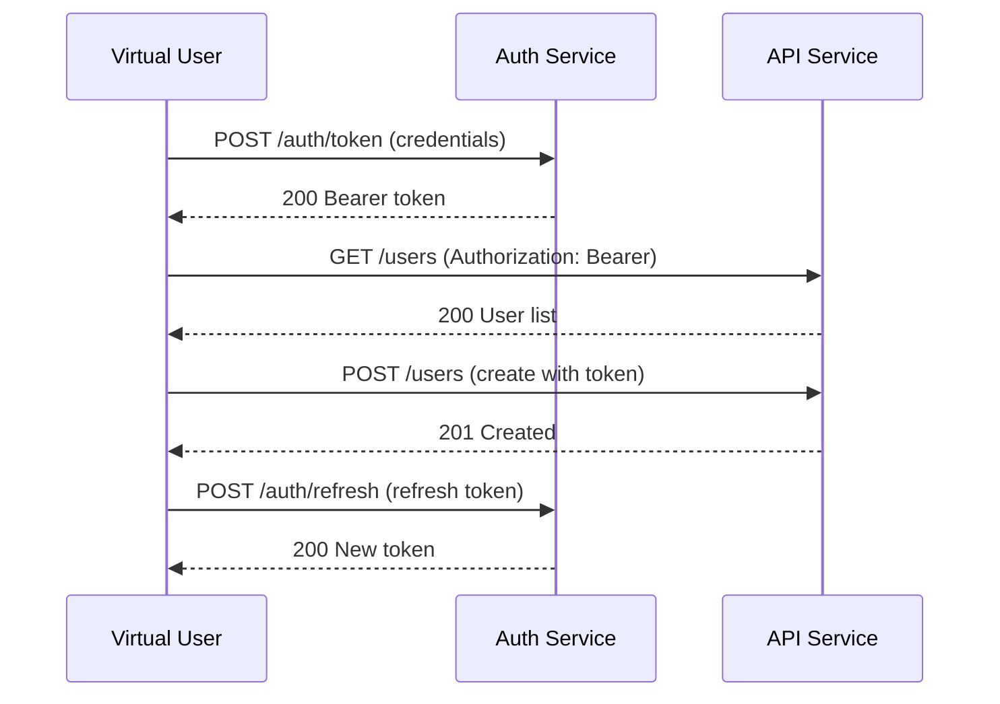
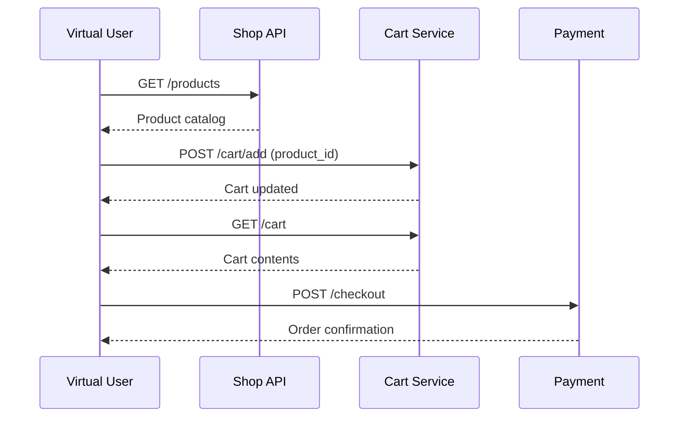

> [Español](README.es.md) | **English**

# k6 Enterprise Framework — Example Scenarios (T-157 / T-175)

Reference client demonstrating framework features across all supported protocols and patterns.
Scenarios are organized by complexity: **Basic → Intermediate → Advanced**.

---

## Quick Start

```bash
# Run all examples (smoke profile)
./bin/run-all-tests.sh --client=examples --profile=smoke

# Run all examples in parallel
./bin/run-all-tests.sh --client=examples --parallel --concurrency=4

# Run a single scenario
./bin/run-test.sh --client=examples --scenario=api/01-auth-bearer --profile=smoke
```

---

## Scenario Index

Ordered by complexity. Start with **Basic** scenarios to verify your environment.

| # | File | Executor | Protocol | Level | Demonstrates | CLI |
|---|------|----------|----------|-------|-------------|-----|
| 01 | `api/01-auth-bearer.ts` | constant-vus | HTTP | Basic | Bearer auth, AuthPattern | `--scenario=api/01-auth-bearer` |
| 02 | `api/02-contract-validation.ts` | constant-vus | HTTP | Basic | JSON schema contract testing | `--scenario=api/02-contract-validation` |
| 03 | `api/03-pagination.ts` | constant-vus | HTTP | Basic | Cursor/offset pagination | `--scenario=api/03-pagination` |
| 04 | `api/04-retry-backoff.ts` | constant-vus | HTTP | Intermediate | Exponential backoff, retries | `--scenario=api/04-retry-backoff` |
| 05 | `api/05-correlation.ts` | constant-vus | HTTP | Intermediate | Token extraction, request chaining | `--scenario=api/05-correlation` |
| 06 | `api/06-weighted-execution.ts` | constant-vus | HTTP | Intermediate | Weighted scenario distribution | `--scenario=api/06-weighted-execution` |
| 07 | `api/07-structured-logging.ts` | constant-vus | HTTP | Intermediate | Structured JSON logs, ELK | `--scenario=api/07-structured-logging` |
| 08 | `api/08-rate-limiting.ts` | constant-vus | HTTP | Intermediate | 429 handling, throttle detection | `--scenario=api/08-rate-limiting` |
| 09 | `mixed/09-ecommerce-flow.ts` | ramping-vus | HTTP | Advanced | Multi-step user journey | `--scenario=mixed/09-ecommerce-flow` |
| 10 | `api/10-graphql.ts` | constant-vus | GraphQL | Advanced | Query + mutation, variables | `--scenario=api/10-graphql` |
| 11 | `api/11-file-upload.ts` | constant-vus | HTTP | Advanced | Multipart/form-data upload | `--scenario=api/11-file-upload` |
| 12 | `integration/12-websocket.ts` | constant-vus | WebSocket | Advanced | Connect, send, receive, close | `--scenario=integration/12-websocket` |
| 13 | `mixed/13-multi-protocol.ts` | ramping-vus | HTTP+WS | Advanced | Mixed protocol workload | `--scenario=mixed/13-multi-protocol` |
| 14 | `api/14-advanced-headers.ts` | constant-vus | HTTP | Intermediate | Custom headers, tracing | `--scenario=api/14-advanced-headers` |
| 15 | `integration/15-smoke-baseline.ts` | constant-vus | HTTP | Basic | Smoke baseline (CI gate) | `--scenario=integration/15-smoke-baseline` |
| 16 | `integration/16-sli-monitoring.ts` | ramping-vus | HTTP | Advanced | SLI tracking, SLO thresholds, error budget | `--scenario=integration/16-sli-monitoring` |
| 99 | `mixed/99-full-dashboard-demo.ts` | constant-vus | HTTP+Browser | Advanced | Groups, Custom Metrics, Web Vitals, SLA thresholds | `--scenario=mixed/99-full-dashboard-demo` |

---

## Complexity Guide

### Basic (1–3): Verify your environment works

Start here. These scenarios run in under 1 minute and validate your setup.

```bash
./bin/run-test.sh --client=examples --scenario=api/01-auth-bearer --profile=smoke
./bin/run-test.sh --client=examples --scenario=api/02-contract-validation --profile=smoke
./bin/run-test.sh --client=examples --scenario=integration/15-smoke-baseline --profile=smoke
```

### Intermediate (4–8, 14): Common HTTP patterns

Retry logic, correlation, rate limiting, and logging patterns used in real services.

```bash
./bin/run-test.sh --client=examples --scenario=api/04-retry-backoff --profile=quick
./bin/run-test.sh --client=examples --scenario=api/08-rate-limiting --profile=quick
```

### Advanced (9–13): Multi-step flows and protocols

Full user journeys, GraphQL, WebSockets, and multi-protocol workloads.

```bash
./bin/run-test.sh --client=examples --scenario=mixed/09-ecommerce-flow --profile=load
./bin/run-test.sh --client=examples --scenario=integration/12-websocket --profile=quick
```

---

## Expected Outputs

All scenarios target `https://httpbin.test.k6.io` (k6 public test backend) or
`http://localhost:8080` when the mock server is running.

| Scenario | Expected checks | Expected p95 | Expected errors |
|----------|----------------|--------------|-----------------|
| 01-auth-bearer | 100% | < 1500ms | < 1% |
| 02-contract-validation | 100% | < 1500ms | < 1% |
| 03-pagination | > 95% | < 2000ms | < 5% |
| 04-retry-backoff | > 90% | < 3000ms | < 5% |
| 05-correlation | 100% | < 2000ms | < 1% |
| 06-weighted-execution | > 95% | < 1500ms | < 5% |
| 07-structured-logging | > 95% | < 1500ms | < 1% |
| 08-rate-limiting | > 80% | < 5000ms | < 20% (expected) |
| 09-ecommerce-flow | > 95% | < 1000ms (SLI) | < 5% |
| 10-graphql | > 90% | < 2000ms | < 5% |
| 12-websocket | > 90% | < 5000ms | < 10% |
| 15-smoke-baseline | 100% | < 1000ms | < 1% |
| 16-sli-monitoring | > 95% | < 800ms (SLI p95) | < 1% |

---

## Run All with Variants

```bash
# Run all sequentially (safe, clear output)
./bin/run-all-tests.sh --client=examples --profile=smoke

# Run all in parallel (faster, 4 concurrent)
./bin/run-all-tests.sh --client=examples --parallel --concurrency=4 --profile=quick

# Run only API scenarios
./bin/run-all-tests.sh --client=examples --pattern="scenarios/api/*.ts" --profile=smoke

# Run against a staging environment with load profile
./bin/run-all-tests.sh --client=examples --env=staging --profile=load
```

---

## Observability Integration

Scenarios 09 and 16 include full observability instrumentation (tracing, logging, profiling). To send data to the observability stack:

```bash
# 1. Start the observability stack
docker compose --profile observability up -d

# 2. Run with full observability
./bin/run-test.sh --client=examples --scenario=integration/16-sli-monitoring \
  --profile=smoke --observability

# 3. View data in Grafana (http://localhost:3000):
#    - Prometheus: k6_* metrics + custom SLI metrics
#    - Loki: structured test logs with labels (client, profile, env)
#    - Tempo: distributed traces with W3C trace propagation
#    - Pyroscope: profiling data via X-Pyroscope headers
```

### Observability Flags

| Flag | Description |
|------|-------------|
| `--prometheus` | Send metrics via Prometheus remote-write |
| `--loki` | Send logs to Loki (replaces file output) |
| `--tempo` | Send traces to Tempo via OTLP gRPC |
| `--otel` | Send metrics via OpenTelemetry |
| `--observability` | Enable ALL: Prometheus + Loki + Tempo + OTEL |

---

## Best Practices

- [ ] Always run `npm run build` before running tests after code changes
- [ ] Start with `--profile=smoke` to verify the scenario works before heavier profiles
- [ ] Use `--skip-build` for faster iteration when you haven't changed TypeScript
- [ ] Set `APP_API_TOKEN` before running auth scenarios
- [ ] Start the mock server for offline testing: `node bin/mock-server.js &`
- [ ] Check the HTML report in `reports/examples/<scenario>/` after each run
- [ ] Use `--profile=quick` in CI pipelines for fast feedback (< 3 min)
- [ ] Use comparison reports to detect regressions across runs
- [ ] Use `--observability` flag to send data to Grafana stack for visual analysis

---

## Troubleshooting

| Symptom | Cause | Fix |
|---------|-------|-----|
| `Build error` | TypeScript compile failed | Run `npm run build` and check errors |
| `connection refused` | No target server | Start mock: `node bin/mock-server.js &` |
| `401 Unauthorized` | Missing auth token | `export APP_API_TOKEN=test-token` |
| `Import error` | Missing dist/ files | Run `npm run build` first |
| `p95 > 2000ms` | httpbin latency varies | Normal for public endpoint — use `--profile=smoke` |
| `ECONNRESET` | Network instability | Retry or use `--env K6_ENV=default` |
| `No baseline found` | First run | Normal — baseline created on second run |
| `threshold failure` | SLO not met | Check response times vs threshold config |

---

## Diagram: auth-flow



---

## Diagram: ecommerce-flow


