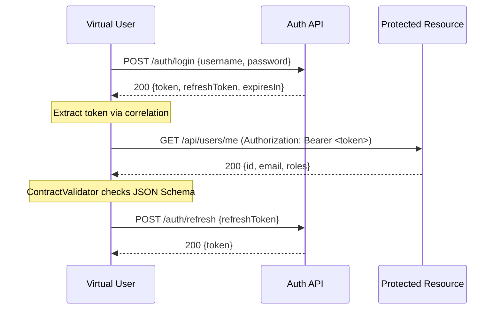
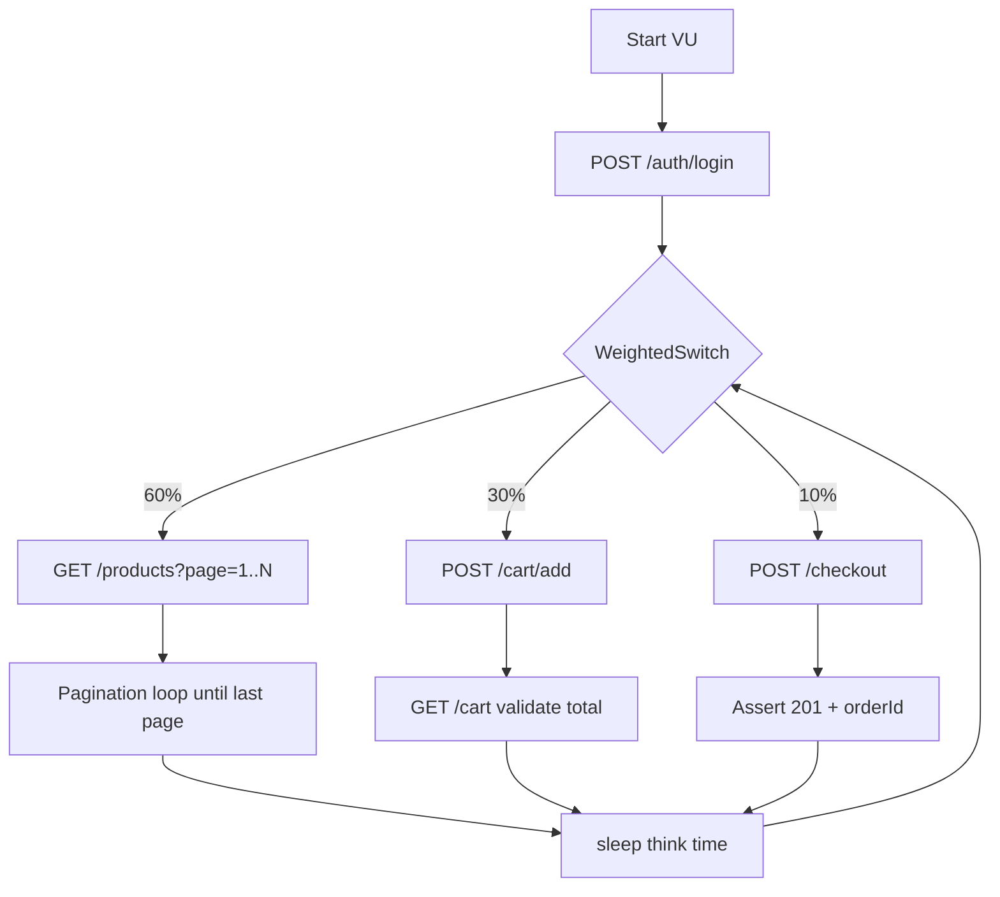

# _reference — Reference Client

Canonical reference implementation of the k6 Enterprise Framework client layer.
Use as a starting point for new clients and to understand framework capabilities.

## Scenario Index

| # | Scenario | Complexity | Protocols | Patterns | Expected p95 |
|---|----------|-----------|-----------|----------|-------------|
| 1 | `api/smoke-users` | Basic | HTTP | Auth, Correlation, Checks | < 500ms |
| 2 | `integration/auth-flow` | Intermediate | HTTP | Retry, ContractValidation | < 1000ms |
| 3 | `mixed/checkout-flow` | Advanced | HTTP | Pagination, WeightedSwitch, PerformanceHelper | < 800ms |
| 4 | `api/16-redis-data-pool` | Intermediate | HTTP+Redis | SharedArray, DataPool, Teardown | < 500ms |

---

## Running Scenarios

```bash
# Basic (1-3): smoke test — fastest CI check (~1 min)
./bin/run-test.sh --client=_reference --scenario=api/smoke-users --profile=smoke

# Intermediate (4-8): load test — normal traffic (~14 min)
./bin/run-test.sh --client=_reference --scenario=integration/auth-flow --profile=load

# Advanced (9-15): stress test — find breaking point (~25 min)
./bin/run-test.sh --client=_reference --scenario=mixed/checkout-flow --profile=stress

# Run all reference scenarios
./bin/testing/run-all-tests.sh --client=_reference

# Parallel execution (faster CI)
./bin/testing/run-all-tests.sh --client=_reference --parallel=2

# With a specific environment
./bin/run-test.sh --client=_reference --scenario=api/smoke-users --profile=smoke --env=staging
```

---

## Scenario Details

### 1. `api/smoke-users` — Basic

**Purpose**: Verify the service is operational. Fastest scenario for CI gates.

**Flow**:
```
GET /health → 200
POST /auth/login → extract token
GET /users?page=1 → check schema
GET /users/:id → check response time
```

**Expected output**:
```
checks................: 100%   ✓ 24 ✗ 0
http_req_duration.....: p(95)=245ms   ← should be < 500ms
http_req_failed.......: 0.00%
```

**Troubleshooting**:
- Mock server not running → `npm run mock -- --client=_reference`
- `BASE_URL` not set → check `clients/_reference/config/default.json`
- Auth fails (401) → verify `APP_API_TOKEN` env var is set

---

### 2. `integration/auth-flow` — Intermediate

**Purpose**: Validate the full auth + token flow under load with contract testing.

**Flow** (mermaid):


**Expected output**:
```
checks................: 100%   ✓ schema_valid, status_200, token_present
http_req_duration.....: p(95)=380ms   ← should be < 1000ms
http_req_failed.......: 0.00%
```

**Troubleshooting**:
- `AUTH_USERNAME` / `AUTH_PASSWORD` not set → add to `.env` or pass via `--env`
- 401 errors → invalid credentials or expired token
- Schema violations → upstream API changed; update `lib/services/user-service.ts`

---

### 3. `mixed/checkout-flow` — Advanced

**Purpose**: End-to-end checkout flow with pagination, weighted traffic, and perf analysis.

**Flow** (mermaid):


**Expected output**:
```
checks................: 95%+   ✓ status, schema, response_time
http_req_duration.....: p(95)=650ms   ← should be < 800ms
iterations............: 200+  at 20 VUs
```

**Troubleshoot**:
- High error rate → payment service mock must be running (`npm run mock`)
- Slow p95 → reduce `--profile` to `load` or add `--env K6_THINK_TIME_MS=500`
- Pagination loop infinite → check `totalPages` in response schema

---

### 4. `api/16-redis-data-pool` — Intermediate

**Purpose**: Demonstrate unique data-per-VU pattern using Redis SharedArray.

**Requires**: Redis running (`docker compose --profile redis up -d`)

**Expected output**:
```
[setup]  Loaded 100 users into Redis pool
[default] Each VU consumes unique user — no collisions
[teardown] Cleaned up Redis keys
```

**Troubleshoot**:
- `REDIS_URL` not set → defaults to `redis://localhost:6379`
- Connection refused → start Redis: `docker compose --profile redis up -d`

---

## Best Practices Checklist

- [ ] No hardcoded credentials — use `${ENV_VAR}` in config or `.env`
- [ ] Every scenario has `thresholds` defined (p95, error rate)
- [ ] Auth tokens extracted via correlation, not stored as globals
- [ ] Schema validation on key responses (`ContractValidator`)
- [ ] Think time between requests (`sleep(randomBetween(1, 3))`)
- [ ] `setup()` / `teardown()` for stateful resources (Redis, DB seeds)
- [ ] Scenario runs clean from smoke to stress without code changes
- [ ] Report artifacts saved to `reports/_reference/<scenario>/`

---

## Structure

```
clients/_reference/
├── config/
│   ├── default.json        # Local/dev environment config
│   ├── staging.json        # Staging environment config
│   └── production.json     # Production environment config
├── data/
│   ├── users.csv           # Sample user data (no real passwords)
│   └── products.json       # Sample product catalog
├── lib/
│   ├── services/
│   │   └── user-service.ts # API encapsulation (auth + checks)
│   └── factories/
│       └── user-factory.ts # Test data generation with DataHelper
├── scenarios/
│   ├── api/
│   │   ├── smoke-users.ts        # Auth + correlation + weighted distribution
│   │   └── 16-redis-data-pool.ts # Redis SharedArray data pool
│   ├── integration/
│   │   └── auth-flow.ts          # Retry + contract validation + correlation
│   └── mixed/
│       └── checkout-flow.ts      # Pagination + correlation + perf analysis
└── README.md
```

## Security Notes

- No real credentials stored here — use `.env` or secrets manager
- Passwords in `data/users.csv` use `placeholder_use_secrets` — intentional
- All auth tokens are scoped per VU iteration, never stored as globals
- Run `./bin/run-test.sh --help` for how to pass secrets via env vars
