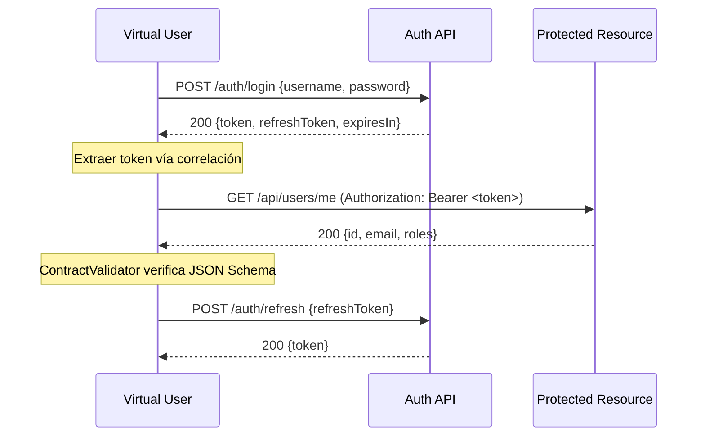
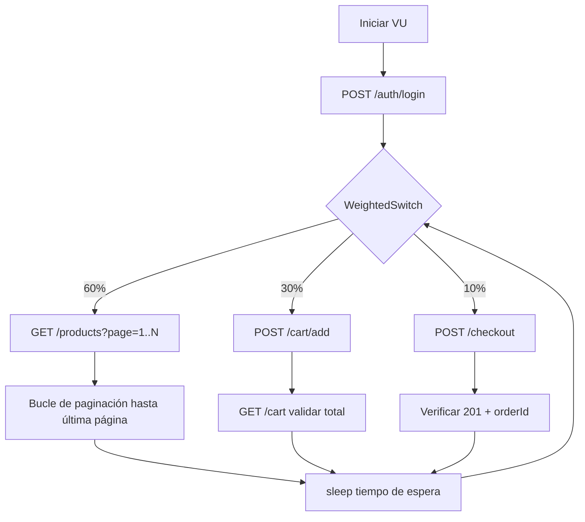

# _reference — Cliente de Referencia

Implementación de referencia canónica de la capa de cliente del k6 Enterprise Framework.
Usar como punto de partida para nuevos clientes y para entender las capacidades del framework.

## Índice de Escenarios

| # | Escenario | Complejidad | Protocolos | Patrones | p95 Esperado |
|---|-----------|------------|-----------|----------|-------------|
| 1 | `api/smoke-users` | Básico | HTTP | Auth, Correlation, Checks | < 500ms |
| 2 | `integration/auth-flow` | Intermedio | HTTP | Retry, ContractValidation | < 1000ms |
| 3 | `mixed/checkout-flow` | Avanzado | HTTP | Pagination, WeightedSwitch, PerformanceHelper | < 800ms |
| 4 | `api/16-redis-data-pool` | Intermedio | HTTP+Redis | SharedArray, DataPool, Teardown | < 500ms |

---

## Ejecución de Escenarios

```bash
# Básico (1-3): smoke test — verificación CI más rápida (~1 min)
./bin/run-test.sh --client=_reference --scenario=api/smoke-users --profile=smoke

# Intermedio (4-8): load test — tráfico normal (~14 min)
./bin/run-test.sh --client=_reference --scenario=integration/auth-flow --profile=load

# Avanzado (9-15): stress test — encontrar punto de ruptura (~25 min)
./bin/run-test.sh --client=_reference --scenario=mixed/checkout-flow --profile=stress

# Ejecutar todos los escenarios de referencia
./bin/testing/run-all-tests.sh --client=_reference

# Ejecución paralela (CI más rápido)
./bin/testing/run-all-tests.sh --client=_reference --parallel=2

# Con un entorno específico
./bin/run-test.sh --client=_reference --scenario=api/smoke-users --profile=smoke --env=staging
```

---

## Detalles de Escenarios

### 1. `api/smoke-users` — Básico

**Propósito**: Verificar que el servicio está operativo. Escenario más rápido para gates de CI.

**Flujo**:
```
GET /health → 200
POST /auth/login → extraer token
GET /users?page=1 → verificar esquema
GET /users/:id → verificar tiempo de respuesta
```

**Salida esperada**:
```
checks................: 100%   ✓ 24 ✗ 0
http_req_duration.....: p(95)=245ms   ← debe ser < 500ms
http_req_failed.......: 0.00%
```

**Solución de problemas**:
- Servidor mock no está corriendo → `npm run mock -- --client=_reference`
- `BASE_URL` no definida → verificar `clients/_reference/config/default.json`
- Fallo de autenticación (401) → verificar que la variable de entorno `APP_API_TOKEN` esté configurada

---

### 2. `integration/auth-flow` — Intermedio

**Propósito**: Validar el flujo completo de autenticación + token bajo carga con pruebas de contrato.

**Flujo** (mermaid):


**Salida esperada**:
```
checks................: 100%   ✓ schema_valid, status_200, token_present
http_req_duration.....: p(95)=380ms   ← debe ser < 1000ms
http_req_failed.......: 0.00%
```

**Solución de problemas**:
- `AUTH_USERNAME` / `AUTH_PASSWORD` no definidas → agregar a `.env` o pasar vía `--env`
- Errores 401 → credenciales inválidas o token expirado
- Violaciones de esquema → la API upstream cambió; actualizar `lib/services/user-service.ts`

---

### 3. `mixed/checkout-flow` — Avanzado

**Propósito**: Flujo de compra de extremo a extremo con paginación, tráfico ponderado y análisis de rendimiento.

**Flujo** (mermaid):


**Salida esperada**:
```
checks................: 95%+   ✓ status, schema, response_time
http_req_duration.....: p(95)=650ms   ← debe ser < 800ms
iterations............: 200+  con 20 VUs
```

**Solución de problemas**:
- Tasa de errores alta → el mock del servicio de pagos debe estar corriendo (`npm run mock`)
- p95 lento → reducir `--profile` a `load` o agregar `--env K6_THINK_TIME_MS=500`
- Bucle de paginación infinito → verificar `totalPages` en el esquema de respuesta

---

### 4. `api/16-redis-data-pool` — Intermedio

**Propósito**: Demostrar el patrón de datos únicos por VU usando Redis SharedArray.

**Requiere**: Redis corriendo (`docker compose --profile redis up -d`)

**Salida esperada**:
```
[setup]  Loaded 100 users into Redis pool
[default] Each VU consumes unique user — no collisions
[teardown] Cleaned up Redis keys
```

**Solución de problemas**:
- `REDIS_URL` no definida → por defecto usa `redis://localhost:6379`
- Conexión rechazada → iniciar Redis: `docker compose --profile redis up -d`

---

## Lista de Mejores Prácticas

- [ ] Sin credenciales hardcodeadas — usar `${ENV_VAR}` en config o `.env`
- [ ] Cada escenario tiene `thresholds` definidos (p95, tasa de errores)
- [ ] Tokens de autenticación extraídos vía correlación, no almacenados como globales
- [ ] Validación de esquema en respuestas clave (`ContractValidator`)
- [ ] Tiempo de espera entre peticiones (`sleep(randomBetween(1, 3))`)
- [ ] `setup()` / `teardown()` para recursos con estado (Redis, semillas de BD)
- [ ] El escenario se ejecuta limpio desde smoke hasta stress sin cambios de código
- [ ] Artefactos de reporte guardados en `reports/_reference/<scenario>/`

---

## Estructura

```
clients/_reference/
├── config/
│   ├── default.json        # Configuración de entorno local/dev
│   ├── staging.json        # Configuración de entorno staging
│   └── production.json     # Configuración de entorno producción
├── data/
│   ├── users.csv           # Datos de usuarios de ejemplo (sin contraseñas reales)
│   └── products.json       # Catálogo de productos de ejemplo
├── lib/
│   ├── services/
│   │   └── user-service.ts # Encapsulación de API (auth + checks)
│   └── factories/
│       └── user-factory.ts # Generación de datos de prueba con DataHelper
├── scenarios/
│   ├── api/
│   │   ├── smoke-users.ts        # Auth + correlación + distribución ponderada
│   │   └── 16-redis-data-pool.ts # Pool de datos Redis SharedArray
│   ├── integration/
│   │   └── auth-flow.ts          # Reintentos + validación de contrato + correlación
│   └── mixed/
│       └── checkout-flow.ts      # Paginación + correlación + análisis de rendimiento
└── README.md
```

## Notas de Seguridad

- No se almacenan credenciales reales aquí — usar `.env` o gestor de secretos
- Las contraseñas en `data/users.csv` usan `placeholder_use_secrets` — es intencional
- Todos los tokens de autenticación tienen alcance por iteración de VU, nunca se almacenan como globales
- Ejecutar `./bin/run-test.sh --help` para saber cómo pasar secretos vía variables de entorno
